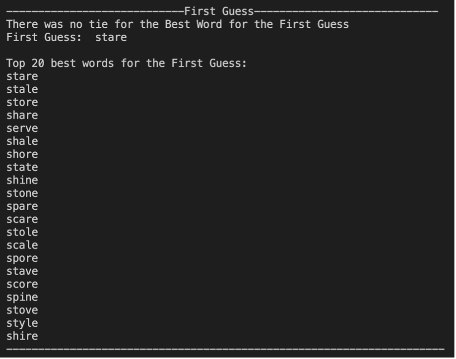
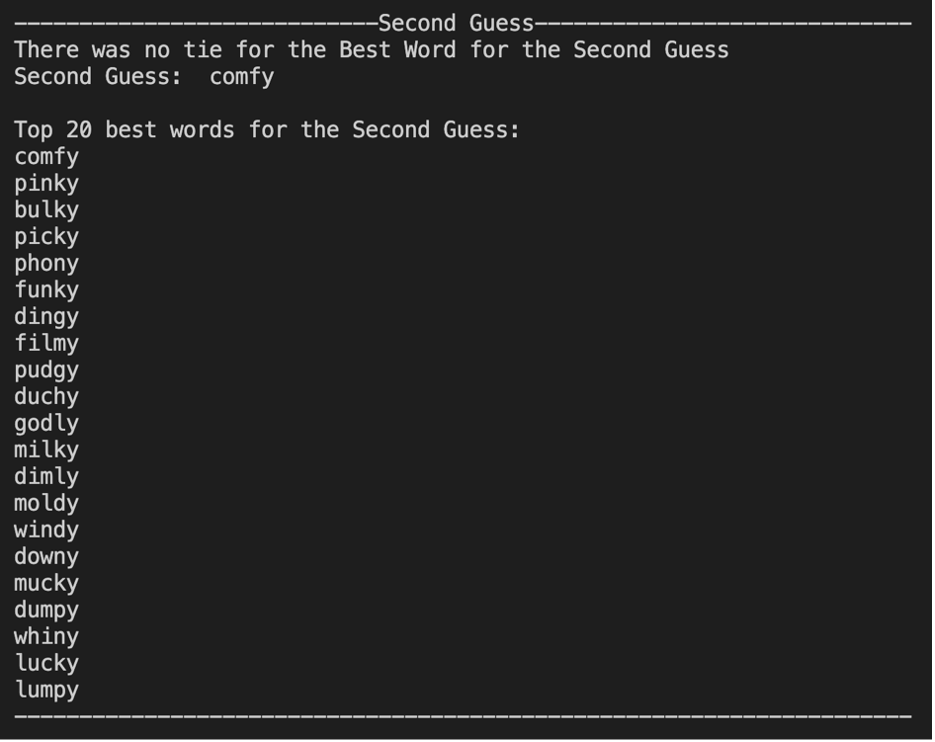
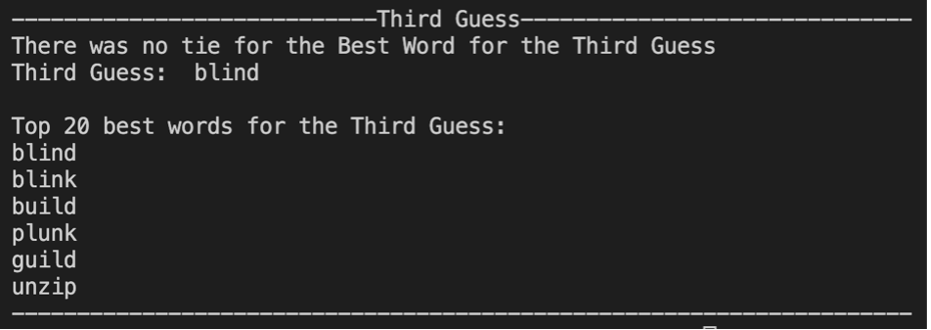
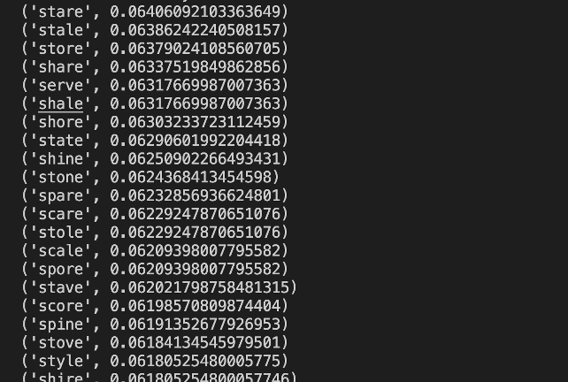
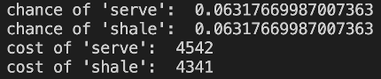
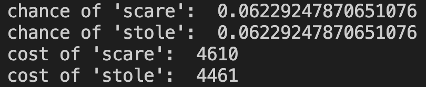

# Predicting words for the New York Times Wordle Game

The project is to write a program cost function, and a program to search for it. The program will then take the list of Wordle Words, and find three good starting words. The goal is to have the first three words (five letters each) test 15 different letters.

In your write-up, describe your cost function. Your program should load all of the words, then pick a word that best fits that cost function.

Once that first word has been selected, your program should winnow down the choices for other words. Then pick a second word, again based on some kind of cost function that you designed.

The selection of a second word will further reduce the set of possible words to use which do not
conflict. Then you pick a third word.

## Cost Function

Cost Function = Objective Function + Regularization

I had shortlisted a few key features important in guessing initial words of the wordle. The features were, Duplicate Letter in a word, Letter Frequency in the word list, Frequency of Letters being at the first index, Bigram and Trigram transitions. My selection for Objective function was Frequency of Letter being at the first index of the word. The objective function needs to be highest. Cost of guessing the word starting with first letter being correct is assigned high. In our given wordle_words.csv file, we see that there are many words starting with the letter 'S'. Chances of that wordle word starting with 'S' is relatively high. My selection for Regularization was letter frequency. Regularization may or may not be high but it good if it high. Similarly, it is better to have letter with high frequency in your word, as guessing is easier. Therefore, Cost assigned to letter frequency, being its actually frequency, is high. I’m using cost function to break the tie of chances of the words being the guess.

## First Word

The first word found is “stare”. The were no ties found while calculating the chance of the words, “stare” scoring the highest. If there was a tie, I would’ve used the cost function to break the tie.

## Second Word

The second word found is “comfy”. The first word being “stare”, the second choice was made from the subset of words which didn’t have letters “s”, “t”, “a”, “r” and “e” in it. There were words close to the second guess but there was not a tie in their chance. If there was tie, the cost function would have broken the tie, mentioning the occurrence of tie, and the second-best word in the output.

## Third Word

The third word found is “blind”. The third word is calculated from a subset of words which don’t have the characters of the first and the second word. While finding the chance of the remaining words, again, there was still not tie while choosing the third word. The tie, if there was one, would have been broken by the cost function. The remaining alternative were as follows.

## Conclusion

The written code computes Cost Function breaking ties, finds three good starting words and achieves the goal to have first three words, five letters each, testing 15 different letters. 

I am computing the first word by calculating the chance of each word occurring. As mentioned, we define the total chance of a word occurring as the sum of the probabilities of each character transition, divided by the number of transitions. For example, “hunch” is ( chance of word starting with the letter “h”, plus the chance of “hu”, plus the chance of “un”, plus the chance of “nc”, plus the chance of “ch”, plus the chance of a word ending in “h” ) all divided by 6 transitions. The chances are then sorted descending with word have highest chance of occurring first and least last. The first word is found by checking the first 2 values of the sorted chance list. And if there is tie it is broken by the cost function. 
For example, while computing the chance, I found a few words have same chance (not the first 2 words with highest chance) 

As you can see the chance of words “serve” and “shale”, “scare” and “stole” are the same, using the cost function we break the tie and choose one over other.

The cost function is computed by adding the frequency of first letter of word being in the first index and frequency of each letter in the word in the word list. 

Next, the second word is guessed the same way but we excluding the words have letter of the first word, narrowing down our word list. We also reject words which have duplicate letter in them. We compute the chances of each word in out narrowed down list and find the second word, breaking the tie using cost function if there is one. 

Moving on, we find the third word, narrowing down our word list even more excluding the letters in the first and the second word, rejecting 10 characters now. Again, we compute chances of the remaining words, break ties if any, and find the third word. 

We explored and learnt feature selection, probability analysis and cost function computation in this project. I had a ball working on it!

